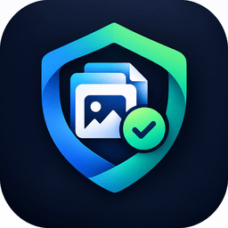

<p align="center">
  
</p>

<h1 align="center">Asset Guardian for Craft CMS</h1>

<p align="center">
  <strong>Asset Health & Safe Cleanup for Craft CMS 5.x</strong><br>
  <em>Know what's safe to review before you clean your digital asset library.</em>
</p>

<p align="center">
  <a href="https://craftcms.com"></a>
  <a href="https://php.net"></a>
  <a href="LICENSE.md"></a>
  <a href="https://github.com/Abdulkadiragoliya/craft-asset-guardian"></a>
</p>

---

## 📖 Overview

**Asset Guardian** is an asset health, auditing, and safe-cleanup plugin tailored specifically for **Craft CMS 5.x**. Built for digital agencies, site administrators, and content teams, Asset Guardian provides complete visibility into your digital assets:

- **Unused Assets Discovery:** Deep reference scanning across Entries, Matrix blocks (including nested blocks), CKEditor, Redactor, Categories, Users, and Globals.
- **Content-Hash Duplicate Detection:** Fast MD5 fingerprinting to identify exact content duplicates, with safe, transactional repointing before moving clones to trash.
- **Oversized Media Triage:** Instant filtering for media exceeding configurable thresholds (1 MB, 5 MB, 10 MB, 50 MB, 100 MB).
- **Accessibility & Missing Alt Text:** Catalog-wide compliance tracking with an inline AJAX alt-text editor.
- **Safe Cleanup Center:** Soft delete directly to native Craft CMS Trash, dry-run simulations, and one-click restoration from audit logs.
- **Automation & CLI:** Console commands for scheduled cron jobs and terminal-based cleanups.

---

## 🛡️ Safety-First Architecture

Asset Guardian adheres strictly to non-destructive principles:

1. **Deterministic Risk Tiers:** In dynamic environments (custom templates, Twig queries, headless frontends), no automated tool can definitively guarantee zero references. Asset Guardian classifies assets into explainable risk tiers:
   - 🟢 **Low Risk:** Unreferenced and older than the configured grace period (default: 180 days).
   - 🟡 **Medium Risk:** Unreferenced but recently uploaded within the grace period.
   - 🔴 **High Risk:** Actively referenced by entries, matrix blocks, or categories.
2. **Soft Delete by Default:** Cleanup operations move assets to **Craft CMS Trash** (`craft\services\Elements::deleteElement()`). Files are never hard-deleted immediately and can be restored at any time within your retention window or directly from Asset Guardian's History view.
3. **High-Risk Safeguards:** High-risk assets are locked and cannot be selected for bulk deletion.
4. **Dry-Run Simulation:** Preview exactly which files will be affected and calculate reclaimable disk space before committing any action.
5. **Full Audit Trail:** Every operation is logged with user attribution, affected asset IDs, reclaimed bytes, and one-click batch restore.

---

## 🚀 Features

### 1. Unified Health Dashboard
- **Deterministic 100-Point Score:** Weighted algorithm evaluating unused ratio (30%), duplicate footprint (25%), oversized assets (20%), missing alt text (15%), and baseline library ratio (10%).
- **Storage Footprint Analysis:** Visual storage breakdowns grouped by volume and file kind (Images, Documents, Videos, Vectors, Archives).
- **Background Scan Queue:** Multi-stage background queue runner capable of auditing large libraries with live status polling.

### 2. Duplicate Detection & Safe Repointing
- **Content-Hash Fingerprinting:** Matches exact file contents via MD5 hashing regardless of filename or upload date.
- **Smart Primary Selection:** Automatically recommends the best primary file to preserve based on usage depth, metadata completeness, and age.
- **Transactional Repointing:** Safely re-links all entries, matrix blocks, and relations to the primary asset prior to moving clones to trash.

### 3. Missing Alt Text & Accessibility Center
- **Accessibility Compliance Gauge:** Real-time visibility into image accessibility.
- **Inline AJAX Alt Text Editor:** Edit and save image alt text directly in the audit table without opening individual assets.

### 4. Asset Explorer
- Filter and search assets across volume, file kind, usage status, risk rating, duplicate status, and accessibility metadata with server-side pagination.

### 5. Audit Reports & CSV Export
- Download comprehensive CSV reports for Unused Assets, Duplicates, Accessibility Audits, and Executive Summaries.

### 6. CLI Console Commands
```bash
# View current health score and library summary in terminal
php craft asset-guardian/health

# Run library scan from CLI (or cron)
php craft asset-guardian/scan

# Run a dry-run cleanup simulation
php craft asset-guardian/cleanup --dry-run

# Execute non-interactive cleanup on confirmed low-risk assets
php craft asset-guardian/cleanup --safe-only --yes
```

---

## 📋 Requirements

- **Craft CMS:** `^5.0.0`
- **PHP:** `^8.2.0`
- **Database:** MySQL 8.0+ or PostgreSQL 13+

---

## 📦 Installation

### From the Plugin Store

Open your project's Control Panel, go to **Plugin Store**, search for "Asset Guardian", and click **Install**.

### With Composer

Run the following from the root of your Craft CMS project:

```bash
composer require abdulkadiragoliya/asset-guardian
```

Then install the plugin:

```bash
php craft plugin/install asset-guardian
```

---

## ⚙️ Configuration

You can customize Asset Guardian settings via the Control Panel at **Asset Guardian &rarr; Settings**, or create a `config/asset-guardian.php` file:

```php
<?php

return [
    // Threshold in MB for flagging large files (default: 10)
    'largeFileThresholdMb' => 10,

    // Days before an unreferenced asset is considered low risk (default: 180)
    'unusedGracePeriodDays' => 180,

    // File kinds to inspect (image, pdf, document, video, etc.)
    'monitoredFileKinds' => ['image', 'pdf', 'document', 'video', 'compressed'],

    // Volume handles to exclude from automated audits
    'excludedVolumes' => [],

    // Enable soft-delete to Craft Trash (recommended: true)
    'softDeleteDefault' => true,

    // Notification email for automated scan reports
    'notificationEmail' => '',
];
```

---

## 🔐 Permissions

Asset Guardian provides granular Control Panel user permissions:
- **View Dashboard** (`assetGuardian-viewDashboard`)
- **Run Scans** (`assetGuardian-runScans`)
- **View Unused Assets** (`assetGuardian-viewUnusedAssets`)
- **View Duplicate Assets** (`assetGuardian-viewDuplicates`)
- **View Large Files** (`assetGuardian-viewLargeFiles`)
- **View Missing Alt Text** (`assetGuardian-viewMissingAltText`)
- **Edit & Update Alt Text Metadata** (`assetGuardian-manageAltText`)
- **Use Asset Explorer** (`assetGuardian-viewAssetExplorer`)
- **Execute Cleanup Operations** (`assetGuardian-manageCleanup`)
- **Restore Cleanup Operations** (`assetGuardian-restoreCleanup`)
- **Download Reports (CSV)** (`assetGuardian-exportReports`)
- **View Scan History & Audit Logs** (`assetGuardian-viewHistory`)
- **Manage Plugin Settings** (`assetGuardian-manageSettings`)

---

## 🧪 Testing

Asset Guardian includes unit tests for health scoring, risk calculation, and configuration defaults. From the plugin's root directory, run:

```bash
vendor/bin/phpunit -c phpunit.xml.dist
```

---

## 💬 Support

If you encounter any issues, have feature suggestions, or need assistance:

- **Email Support:** [abdulkadir.agoliya@gmail.com](mailto:abdulkadir.agoliya@gmail.com) (responses typically within 24–48 business hours)
- **GitHub Issues:** [github.com/Abdulkadiragoliya/craft-asset-guardian/issues](https://github.com/Abdulkadiragoliya/craft-asset-guardian/issues)
- **Documentation:** [github.com/Abdulkadiragoliya/craft-asset-guardian#readme](https://github.com/Abdulkadiragoliya/craft-asset-guardian#readme)

---

## 📄 License

This plugin is licensed under the [Craft License](LICENSE.md).

- Each license covers one production site. Local, staging, and development environments for that site are fine.
- The license is perpetual, but updates and support require an active annual renewal.
- Licensing features may not be altered or circumvented.

Copyright &copy; 2026 [Abdulkadir Agoliya](https://github.com/Abdulkadiragoliya). All rights reserved.